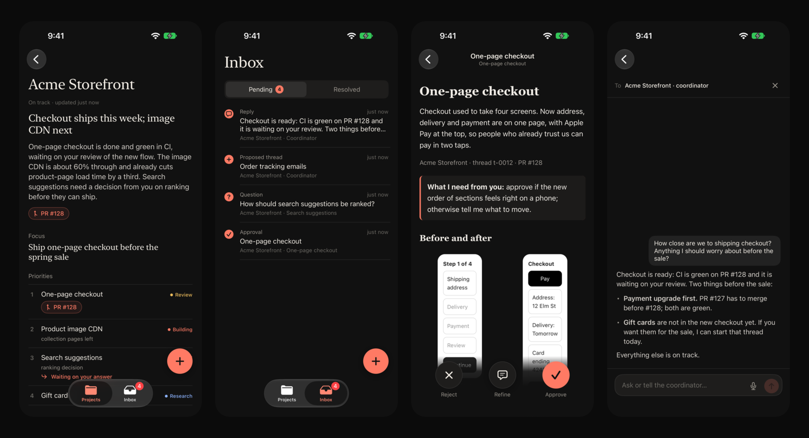
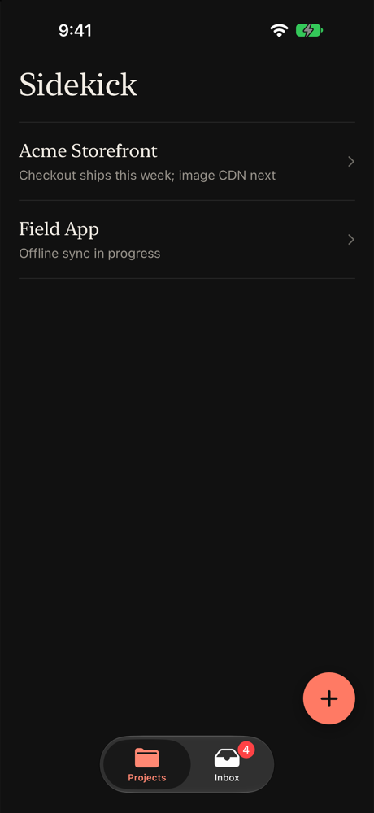
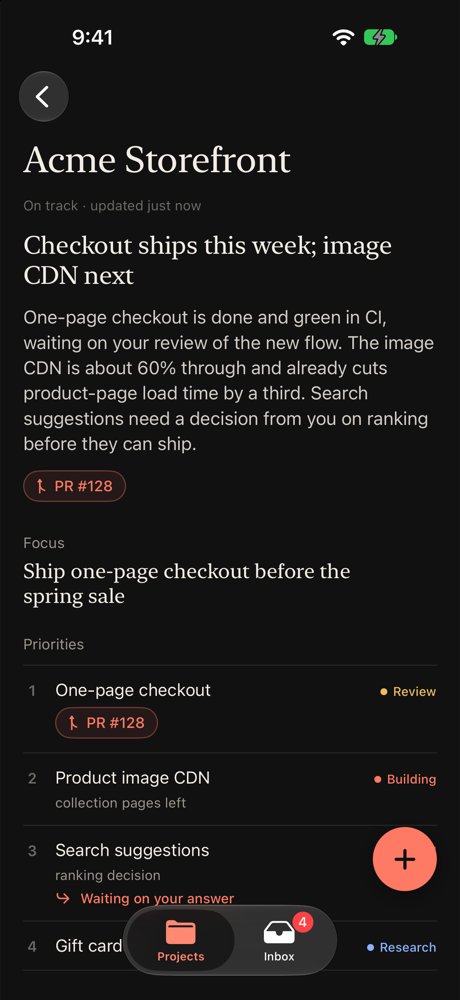
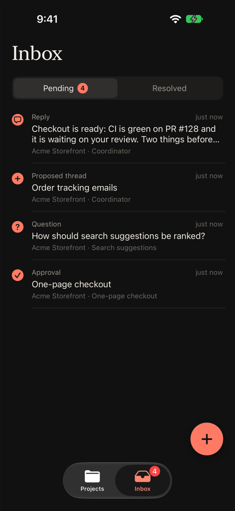
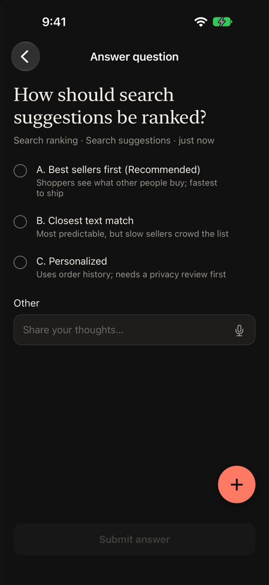
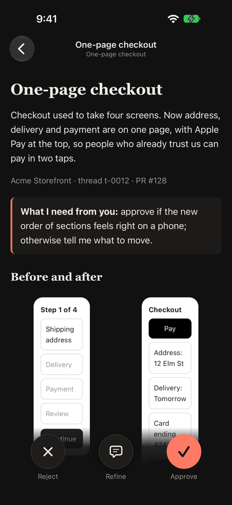
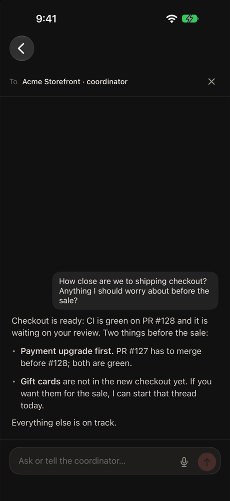
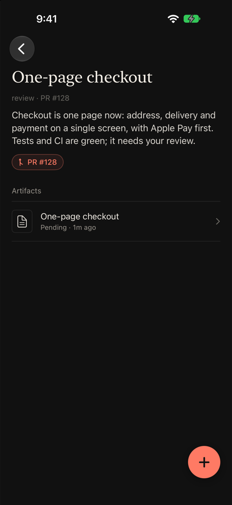
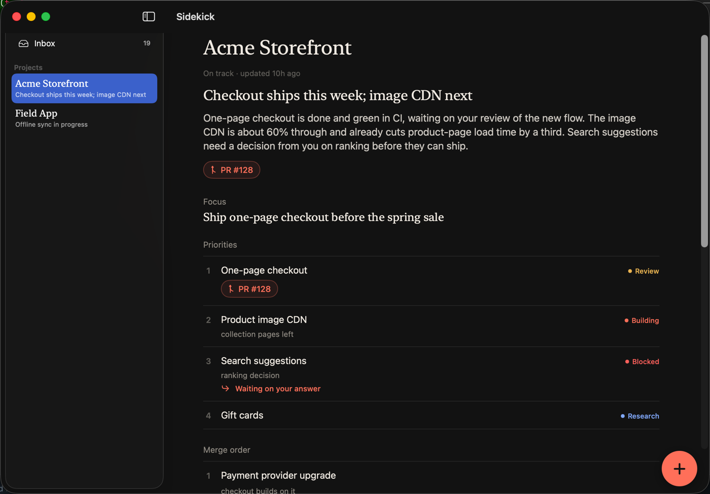

# Sidekick

**Your coding agents, in your pocket.** Sidekick is an iPhone and Mac app for people who
run fleets of AI coding agents with [herdr-projects](https://github.com/eliasstravik/herdr-projects).
Agents keep working on your machine; when they need you, it lands on your phone: a
question to answer, something to review, a new piece of work to approve. You answer in
a tap, a swipe, or by voice, and the agent carries on.



## Why

Agents are good at working for hours; they're bad at getting your attention. Today they
ask in a terminal you aren't looking at, leave decisions buried in long reports, or stop
and wait. Sidekick gives them **exactly two ways to reach you**, and makes both feel
native:

- **Questions.** An agent's normal question tool (Claude Code's `AskUserQuestion`) goes
  to your inbox as a multiple-choice card. Questions are asynchronous: the agent keeps
  working on everything else and picks up your answer when it arrives.
- **Reviews.** Anything worth looking at (a redesign, a report, before/after
  screenshots) arrives as a self-explaining page: what this is, what changed, what the
  agent needs from you. Approve, refine (type or talk), or reject.

Everything else (status, plans, PRs, replies) is there to give you context, not to
interrupt you.

## What you get

| | |
|---|---|
|  | **Every project at a glance.** Each coordinator keeps a one-line headline and a short plain-English summary of where things stand. |
|  | **A real plan, not a log.** Focus, priorities with their stage (research → planning → building → review → merging), the order PRs should merge in, and what's next. PR links are tinted by state and CI. Work waiting on you links straight to the question. |
|  | **One inbox.** Questions, reviews, proposed threads and unread replies, across every project. Swipe right to approve, left to reject. Push notifications on iPhone and Mac. |
|  | **Decisions, framed.** The agent explains the trade-off and puts its recommendation first. When the decision is about something to look at (logo options, a before/after), the agent embeds a page with it right in the question, so you see and decide in one place. |
|  | **Reviews you understand cold.** Agents must publish one HTML page that explains itself and embeds its images; Sidekick refuses folders of files or bare screenshots. |
|  | **Talk to any agent.** Message a project's coordinator or any thread from wherever you are; the reply comes back to the app. Hold the + to dictate, and attach photos, screenshots or files (on the Mac, drag them in or paste). |
|  | **Drop into a thread.** Its summary, PR, artifacts, files it produced and its full report. |

**Voice, on device.** Hold the + (or any mic) to talk. Speech is transcribed locally with
NVIDIA's Parakeet TDT 0.6B through [FluidAudio](https://github.com/FluidInference/FluidAudio)
on the Neural Engine. Audio never leaves your device.

**Proactive coordinators.** Coordinators propose new threads for your approval instead
of waiting to be asked, and keep their plan current. If a plan says work is blocked on
you but nothing is in your inbox, Sidekick reminds the coordinator to ask.

**A page that stays true.** Sidekick checks each project page against what it can see.
Work whose thread finished or whose PR merged shows as done at once, merged PRs leave
the merge order, finished work fades and then clears, and new threads the plan doesn't
mention are listed. When something needs judgment, Sidekick sends the coordinator the
page as you see it with exactly what changed, at most every 30 minutes and only when
the coordinator is idle. The page says when it was last confirmed, and when it's being
checked.

**Mac app.** The same app on the Mac: projects and inbox in a sidebar, a menu bar item
with what's waiting, a Dock badge, Return to send, drag-and-drop attachments.



## How it works

```
  agent panes (herdr)                     your agent host                        you
 ┌──────────────────────┐   hooks / CLI   ┌───────────────────────┐   tailnet   ┌──────────────┐
 │ coordinator, threads │ ──────────────▶ │ sidekick daemon       │ ◀─────────▶ │ iPhone / Mac │
 │ (Claude Code, Codex) │                 │ items, artifacts, PRs │    HTTPS    │ app + push   │
 └──────────────────────┘ ◀────────────── └───────────────────────┘             └──────────────┘
         answers, decisions and messages typed back into the agent's pane (verified)
```

- **One Go binary** (`server/`) is the daemon, the CLI agents call, and its own
  installer. It reads herdr-projects' state read-only, serves the app API and artifacts
  over Tailscale, and sends native push through APNs.
- **Claude Code hooks** relay `AskUserQuestion` to the app (and return immediately),
  capture an agent's reply to your messages when its turn ends, and vouch for prompts
  Sidekick types into a pane so agents trust them. Codex and other agents use the CLI.
- **Skills teach the agents.** A `sidekick` skill tells them how to ask, publish reviews,
  keep summaries and plans current, and propose work. `sidekick doctor --fix` installs
  and repairs everything (skills, hooks, the systemd service, Tailscale serve) from
  copies embedded in the binary, and new projects are onboarded automatically.

### The agent's side

```bash
sidekick review ./page -title "One-page checkout" -summary "Approve if the section order works on a phone"
sidekick status "Checkout ships this week" -summary "…3–4 plain sentences…" -link <PR>
sidekick plan < plan.json                       # focus, priorities and stages, merge order, next
sidekick propose "Order tracking emails" -why "Support gets 40 'where is my order' emails a day"
sidekick template ./page                        # a plain-English starter page for reviews
```

## Try it

You need Go and, for the apps, Xcode with an Apple developer account.

```bash
demo/run.sh                      # a fictional demo project on a local daemon (127.0.0.1:17600)
ios/install-device.sh <TEAM_ID>  # build and install the iPhone app on a connected device
ios/install-mac.sh <TEAM_ID>     # build and install the Mac app
```

Point the app's server setting (long-press the title) at your daemon. The screenshots
above come from `demo/run.sh` in the iOS Simulator.

## Running it for real

On the machine where your agents run (with herdr-projects and Tailscale):

```bash
deploy/install.sh <ssh-host>     # pulls main on the host, builds, installs and runs `sidekick doctor --fix`
```

For push, create an APNs auth key in your Apple developer account and add it to
`~/.config/sidekick/env` on the host:

```
SIDEKICK_APNS_KEY=/home/<you>/.config/sidekick/apns.p8   # chmod 600, never commit it
SIDEKICK_APNS_KEY_ID=<10-character key id>
SIDEKICK_APNS_TEAM_ID=<team id>
```

The bundle ids (`gg.cartridge.sidekick`, `gg.cartridge.sidekick.mac`) and the default
server address live in `ios/project.yml` and `ios/Sidekick/AppModel.swift`; change them
for your own setup.

## Repository

| Path | What |
|---|---|
| `server/` | The Go daemon and CLI (`go test ./...`). |
| `server/assets/` | Agent skills, project instructions, the review template and systemd unit, embedded in the binary. |
| `ios/` | The SwiftUI app for iPhone and Mac (XcodeGen), plus UI tests (`ios/run-ui-tests.sh`). |
| `deploy/` | Deploy scripts for the agent host. |
| `demo/` | The screenshot demo. |

Agents working on Sidekick itself should load the `sidekick-dev` skill: it covers the
layout, APIs, tests, deployment and repairs.
